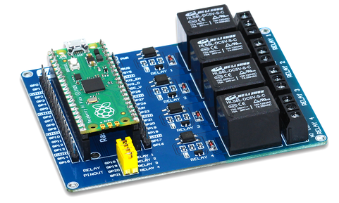
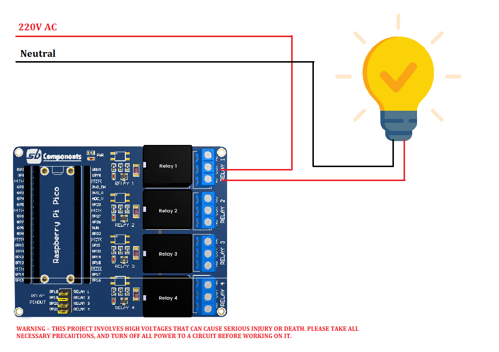

# Raspberry Pi Pico Relay Board

Raspberry Pi Pico Relay Board is developed by SB Components with the potential to control up to 4 appliances and loads up to 240V AC@ 7A, 30V DC@ 10A.

## How to use ?

### Board Details :

* Relay's          :  Relay On = 1, Relay Off = 0 (OUTPUT)

### Requirements

* Raspberry Pi Pico Relay Board (Buy it from : https://shop.sb-components.co.uk/products/raspberry-pi-pico-relay-board )
* Raspberry Pi Pico (Buy it from : https://shop.sb-components.co.uk/collections/latest-collections/products/raspberry-pi-pico-board-with-header )
* USB Cable
* Jumper Cables (optional)

### Steps :

* Connect Raspberry Pi Pico on female header of Pico Relay Board.
* Connect USB cable on Raspberry Pi Pico USB port.
* Make sure default jumpers are connected for each relay.
* Now use example code "Test.py" from pico relay board's github repository in any micropython supported ide (preferred thonny ide).
* Copy paste code in ide and choose interpreter as MicroPython (Raspberry Pi pico).

* Click on green play button to run example on Pico Relay Board.

Note: You can use any other GPIO of Raspberry Pi Pico by removing default jumper and connection it to GPIO using jumper cables. 

### Application : Ac Bulb Control Circuit

